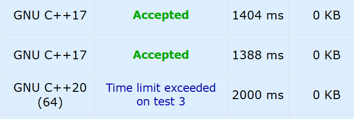

## 错误

- 邻接表，h[]忘记初始化。多组数据时，idx未初始化（会造成数组越界）

- 当使用并查集时，注意自己写的并查集是不是fa[x]随时都是x的祖宗，若不是，记得要用GetFa(x)

- 变量名有冲突`y1`, `next`, `prev`, `has` ...

- 在特别情况下.size()和int整型变量比较时会出错，所以尽量保证式子的运算结果是正数，因为如果是负数，unsigned int类型的变量会变成超大的正数。

- priority_queue 默认是大根堆 < Type,vector,greater >是小根堆

- 图论采用虚拟源点时，注意点和边数组的大小

- double类型存在精度误差，尽量不用`==`判断

- 在函数中引用数组时，用memset() sizeof 传入的数组 是不对的。

- 线段树要开4倍N

- 二分注意二分的数值的大小可能要开LL， mid同理

- dfs or ... if 先判断数组的下标会不会越界再判数组的值

- 字符串不要memset

- &的优先级比==高

- 尽量不要相似的代码复制粘贴，很容易出错然后又不知道错在哪

- map类型, 直接用mp[str], 它自动就插入里面了, 也就是说判里面没有这个元素必须要用mp.count(str) == 0!!!

- static 慎用!!! static cnt = 0; 这里赋值只会在第一次有效

- 字串一般是连续的, 子序列一般是不连续的

- DP的最终答案, 要看状态表示是什么, 题目要求是什么, 不总在最后一行, 如[这题](https://www.acwing.com/problem/content/278/)这种找到一个区域, 最大值可能出现在中间, 枚举答案要全部枚举一遍或者, 边...边更新!!!

- 强制转类型`(LL)a*b+c*d`会存在问题, 类型强制转换貌似是还是先按照运算顺序进行, 然后LL和int操作结果是LL,这个写法只转了a的类型.(LL)(a*b+c...)这样只是改变了括号里一坨的计算完的数据的类型.

- 答案确定了，但是数据没有读完，直接solve函数return;了。（[POJ2492](http://poj.org/problem?id=2492)）

- 自己分类，情况都要走的话，不要if里面直接continue;（[HD1198](https://acm.hdu.edu.cn/showproblem.php?pid=1198)）

- 读入int，LL = int*int，还是会溢出的。[CF1720A](https://codeforces.com/contest/1720/problem/A)

- `^`的优先级比`<`高。（没事多加括号（（

- 树状数组配上离散化，离散化下标要从1开始...不然死循环

- c++20好像不能cin >> str+1; (char*)可能还是要用scanf("%s",str+1);

- cout << fixed << x <<'\n'; (不加fix会存在科学计数法, xls血的教训)

- rbegin()是完全反的迭代器，也是用++ 正常遍历（反向）的。

- sqrt在自动下取整时候，因为是浮点数有误差，建议如果要求下取整等整数情况，自己手搓二分求解！！[悲惨的fst](https://codeforces.com/contest/1737/problem/B)
  - upd，可以sqrt(n)+0.1或者先求sqrt() 然后while来做偏移

- 换`LL`的时候for循环的变量也看看

- 对有除法的式子取模，最好先找到逆元，不然转__int128。[例子](https://codeforces.com/contest/616/problem/E)

- 正确答案在int范围，但可能答案在LL范围，取最小值时由于爆int而变为负数，错误。
  - [ICPC济南2022 A. Tower](https://codeforces.com/gym/104076/problem/A)
  - [Submission #188485811 - Codeforces](https://codeforces.com/gym/104076/submission/188485811) Line 41

- 经过排序，最后一个是理论最大的值，但当多个值相等，给出数的顺序不一样时，排序不稳定，需要完全确定下顺序才行，本题即死循环了。
    - [Problem - K - Codeforces](https://codeforces.com/group/sg0CXKHVzz/contest/421184/problem/K)
    - [Submission #191356094 - Codeforces](https://codeforces.com/group/sg0CXKHVzz/contest/421184/submission/191356094)

- `!!x`在x不是0的时候返回1（

- 按运算顺序加转类型，先算的都要加
    - [Submission #38903149 - Ｓｋｙ Inc, Programming Contest 2023（AtCoder Beginner Contest 289）](https://atcoder.jp/contests/abc289/submissions/38903149)

- 多组测试数据，n多组比较小，用for快，在和边相关的题时，注意第一次要把h[]赋成-1
    - [Submission #39293638 - AtCoder Beginner Contest 291（Sponsored by TOYOTA SYSTEMS）](https://atcoder.jp/contests/abc291/submissions/39293638)

- 计算几何等保留精度，double只有1e-12左右，long double可以试试，或者手动除保留精度
    - 西电2023-CCCC选拔赛-L1-08

- 建议用确定的值来代替范围做判断，特别是有边界的时候
    - [Problem - D - Codeforces](https://codeforces.com/contest/1810/problem/D)

- 设的不可通的无穷大有时候还是需要额外判一下
    - [题目详情 - L3-028 森森旅游 (pintia.cn)](https://pintia.cn/problem-sets/994805046380707840/exam/problems/1386335159927652364)
    - 汇率1e9，前面的最大边权和可能有1e14，还是会错

- 用DAG上找两点之间的路径条数，用记忆化搜索最好，如果是要用BFS来做，需要先用dfs重新建图，来保证bfs时可以用入度为0来保证前后顺序。
    - [题目详情 - L3-025 那就别担心了 (pintia.cn)](https://pintia.cn/problem-sets/994805046380707840/exam/problems/1336215880692482060)

- 概率dp或者记忆化搜索，不是等概率的事件，不能win/tot来求概率，多选择的，所以，每一次选择都需要求概率。

    - [E - Unfair Sugoroku (atcoder.jp)](https://atcoder.jp/contests/abc298/tasks/abc298_e)

- 网络流临时加边/容量不能直接add，然后改idx，因为把h[x]改动了。

    - 这个是暂时想到的写法

        ```cpp
        int tx = h[x], ty = h[y];
        for(int z = 0; z < idx; z += 2)
            e[z] += e[z^1], e[z^1] = 0;
        add(x, y, C), add(y, x, 0);
        LL tres = dinic();
        idx -= 2;
        h[x] = tx, h[y] = ty;
        ```

    - 这个是赛时想到的做法

        ```cpp
        bool ok = false;
        for(int z = 0; z < idx; z += 2) { // .....
            e[z] = rec[z] + (!ok && ver[z] == y && ver[z^1] == x ? C : 0);
            e[z^1] = 0;
            if(ver[z] == y && ver[z^1] == x) ok = true;
        }
        ```

- 浮点数有点问题，把浮点数当作INF，还是早转类型好一点。

    - [Submission #41080823 - TOYOTA MOTOR CORPORATION Programming Contest 2023#1 (AtCoder Beginner Contest 298)](https://atcoder.jp/contests/abc298/submissions/41080823)
    - [Submission #41080850 - TOYOTA MOTOR CORPORATION Programming Contest 2023#1 (AtCoder Beginner Contest 298)](https://atcoder.jp/contests/abc298/submissions/41080850)

- 进制转换的地方最好还是写成`ans = ans*b + x`，配合判断，不容易炸。

- 容器stl的swap，swap(a, b)和a.swap(b)，复杂度一致O(1)，实现为，交换两个指针，pbds是直接swap是O(n)，后一个为O(1)


## 技巧

- 构造
  - 套壳构造
    - 轻重链剖分
    - [Problem - G - Codeforces](https://codeforces.com/gym/420830/problem/G)
    - [Submission #188801932 - Codeforces](https://codeforces.com/gym/420830/submission/188801932)
- 需要对分别找多个数的因子进行计算，可以用线性筛的方式，找到每个数的最小的质因子，然后通过，边求因子，边除掉对应的最小质因子。[Problem - D - Codeforces](https://codeforces.com/contest/1766/problem/D)
- 找一个数的因子，反过来考虑枚举倍数，是调和级数
  - [1291. 轻拍牛头 - AcWing题库](https://www.acwing.com/problem/content/description/1293/)
- 序列删点 - 并查集
  - [经典问题 (xidian.edu.cn)](https://acm.xidian.edu.cn/problem.php?id=1663)
  - 
  - 本题再加上计数排序达到线性
  - 删了i点，fa[i] = i+1
- [Problem - D - Codeforces](https://codeforces.com/group/sg0CXKHVzz/contest/421181/problem/D)
  - x, y坐标直接交换来简化分类讨论
  - 用`优先队列（或者multiset）`+`数组` 动态维护 合法最大值
    - 优先队列里的数据是否符合数组里的最新的值，不符合就删去
    - 值得注意的是Line 67的注释，也就是，不想再用，要注意把数组的值改成不合法的
  - sort + 双指针 + 结构体存多维数据 -> 离散化的效果
- 两个球的体积的交
    - [Problem - G - Codeforces](https://codeforces.com/group/sg0CXKHVzz/contest/421182/problem/G)
    - （赛时公式推的没错，但是我根据交不超过一半推的，没有自信，然后是一个小错误
    - 
    - 
- 1~n的排列的逆序对对数的期望，$\frac{1}{2}{n \choose 2}$
- 求所有约数，可以`线性筛素数->分解质因子->找到所有约数`加速
    - [200. Hankson的趣味题 - AcWing题库](https://www.acwing.com/problem/content/202/)
- 求$x_1+x_2+...+x_n=A$ 或$x_1+x_2+...+x_n\le A$的正整数解的组数（或非负整数，可以左右同加`n`）
    - [1308. 方程的解 - AcWing题库](https://www.acwing.com/problem/content/1310/)
    - [1312. 序列统计 - AcWing题库](https://www.acwing.com/problem/content/1314/)
    - 隔板法
- 不能选同行同列的方案数，可以尝试转化为排列组合问题
    - [1309. 车的放置 - AcWing题库](https://www.acwing.com/problem/content/1311/)
- 莫比乌斯函数，用于判断1~a, 1~b互质的组数，若是同一个范围，可以采用欧拉函数。
    - [215. 破译密码 - AcWing题库](https://www.acwing.com/problem/content/217/)
    - [201. 可见的点 - AcWing题库](https://www.acwing.com/problem/content/203/)
    - [220. 最大公约数 - AcWing题库](https://www.acwing.com/problem/content/222/)
- 从个别去分类讨论思考
    - [题目详情 - L3-032 关于深度优先搜索和逆序对的题应该不会很难吧这件事 (pintia.cn)](https://pintia.cn/problem-sets/994805046380707840/exam/problems/1518582895035215872)
- 树的xx遍历，可以先用dfs，按照相应的方式给树build出来，放在tr数组中，然后再操作
    - [题目详情 - L2-035 完全二叉树的层序遍历 (pintia.cn)](https://pintia.cn/problem-sets/994805046380707840/exam/problems/1336215880692482058)
- set可以当需要增删的边，自己实现查找删边慢！特别是有大小需求，PII非常好！
    - [Problem - D - Codeforces](https://codeforces.com/contest/1797/problem/D)
- 对整棵子树的操作，可以考虑dfs序+树状数组或者树链剖分。
- 有递推关系的数列的和，可以考虑矩阵快速幂。
